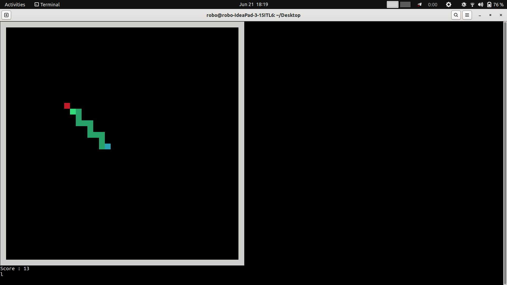

# Snake game
Creating a terminal snake game to apply AI algorithms and watch it play.

## Agents Implemented

Agents are modular and located in `agents/`:
- **Deep TD λ-Learning** (`td.py`)
- **Proximal Policy Optimization**(`ppo.py`)

---


## Directory Structure

snake/<br/>
├── agents/ #All agent implementations<br/>
├── env/ #Snake environment<br/>
├── legacy/ #Old C implementation<br/>
├── trained_models/ #Saved model files<br/>
├── plots/ #Plots saved here after play<br/>
├── train.py #Main training entry point<br/>
├── play.py #Main evaluation entry point<br/>
├── requirements.txt #Libraries used<br/> 
└── README.md #This file<br/>


---


## Usage

### Install dependencies
```bash
pip install -r requirements.txt
```

### Train an agent 

```bash
python3 -m train --h 10 --w 10 --agent ppo --emo False --pomdp True --epochs 200000
```

Supported agents fro emo and pomdp: ppo <br/>
emo: Will access camera and take you face expressions as a reward using DeepFace. <br/>
pomdp: Partial observability - snake can only see one block ahead of it in either direction along with head and apple.<br/>

### Letting agent play

```bash
python3 -m play --h 10 --w 10 --agent td --pomdp True --games 10
```

---

Legacy
```bash
gcc snake.c 
./a.out 
```


